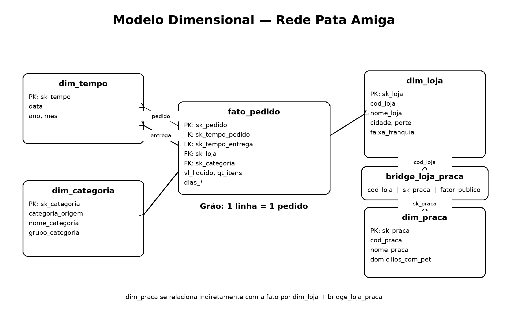

# Projeto de Business Intelligence — Rede Pata Amiga

## 1. Objetivo

Este projeto constrói um modelo dimensional em PostgreSQL para integrar dados de pedidos, cadastro de lojas e praças de atendimento da Rede Pata Amiga. O objetivo é transformar dados de origem com problemas de padronização em informações capazes de responder cinco perguntas de negócio com números reproduzíveis.

O período analisado contém **4.044 pedidos**, entre setembro de 2023 e março de 2024.

As cinco perguntas são:

1. **P1 — Onde está o gargalo da entrega?**
2. **P2 — Qual categoria concentra o faturamento?**
3. **P3 — O desconto funciona igual em todo canal?**
4. **P4 — Qual praça de atendimento concentra o faturamento?**
5. **P5 — Onde abrir a próxima loja, e o que os dados NÃO permitem afirmar?**

---

## 2. Estrutura do projeto

Os scripts SQL são executados na seguinte ordem:

- `00-conferencia.sql` — consultas de conferência;
- `01-carga-staging.sql` — carga das tabelas de staging;
- `02-dimensoes-prontas.sql` — estruturas e dimensões fornecidas;
- `03-suas-dimensoes.sql` — carga de `dim_categoria`, `dim_praca` e `bridge_loja_praca`;
- `04-fato-pedido.sql` — carga da tabela `fato_pedido`;
- `05-respostas.sql` — consultas das cinco perguntas de negócio.

### Grão da tabela fato

O grão da `fato_pedido` é:

> **1 linha = 1 pedido**

A `dim_tempo` é utilizada em dois papéis: data do pedido e data da entrega. A `dim_praca` não se liga diretamente à fato; o caminho é feito por `dim_loja` e `bridge_loja_praca`.

### Modelo dimensional

---

## 3. Diagnóstico da origem

A área de staging contém:

| Tabela | Registros |
| --- | ---: |
| `stg_pedido` | 4.044 |
| `stg_loja` | 32 |
| `stg_loja_praca` | 48 |

Foram identificados os seguintes problemas de qualidade:

| Diagnóstico | Resultado |
| --- | ---: |
| Grafias distintas de categorias | 37 |
| Grafias distintas de nomes de lojas | 128 |
| Grafias distintas de canal de pedido | 20 |
| Grafias distintas da indicação de desconto | 17 |
| Pedidos sem código de loja | 1.575 |
| Pedidos sem nome de loja | 3 |

Também existem marcos logísticos em branco:

| Marco logístico | Registros em branco |
| --- | ---: |
| Separação de estoque | 1.077 |
| Nota fiscal | 1.338 |
| Despacho | 1.665 |
| Entrega ao cliente | 1.953 |

Marco logístico em branco representa processo ainda não concluído dentro da janela observada. Por isso, esses intervalos foram mantidos como `NULL`, e não transformados em zero. O `AVG` do PostgreSQL ignora `NULL`, evitando reduzir artificialmente os tempos médios.

---

## 4. Decisões de tratamento e modelo dimensional

As tabelas de staging foram preservadas. A limpeza foi realizada durante a carga das dimensões e da fato.

Entre as principais decisões de tratamento estão:

- conversão das datas de pedido e integração a partir do formato americano;
- conversão dos quatro marcos logísticos em formato de data;
- valores vazios ou `-` tratados como `NULL`, nunca como zero;
- tratamento dos diferentes formatos monetários;
- normalização dos nomes das lojas antes do lookup;
- padronização das categorias, respeitando a precedência de `MED` antes de `RA`, para que Ração Medicamentosa seja classificada como Medicamento;
- padronização dos canais e da indicação de desconto;
- uso da linha coringa `-1` (`Nao Informado`) quando não foi possível associar uma dimensão;
- preservação de intervalos logísticos não concluídos como `NULL`.

Após a carga:

| Validação | Resultado |
| --- | ---: |
| `dim_tempo` | 236 linhas |
| `dim_loja` | 33 linhas |
| `dim_categoria` | 38 linhas |
| `dim_praca` | 13 linhas |
| `bridge_loja_praca` | 48 linhas |
| `fato_pedido` | 4.044 linhas |
| FKs nulas ou órfãs na fato | 0 |
| Pedidos associados à loja `-1` | 3 |
| Pedidos sem entrega concluída | 1.953 |

Os fatores de público da `bridge_loja_praca` somam **1,00 por loja**.

---

# 5. Respostas às perguntas de negócio

## P1 — Onde está o gargalo da entrega?

A P1 analisa o tempo entre a entrada do pedido no ERP e a chegada à casa do cliente, além dos quatro intervalos do processo.

### Resultado geral

| Etapa | Tempo médio |
| --- | ---: |
| Integração → Separação | 2,13 dias |
| Separação → Nota | 0,64 dia |
| **Nota → Despacho** | **4,11 dias** |
| Despacho → Entrega | 2,14 dias |
| **Integração → Entrega** | **9,00 dias** |

Como existem **1.953 entregas ainda não concluídas**, o tempo total médio é calculado somente para os pedidos que possuem os marcos necessários; os `NULL` não entram no `AVG`.

### Comparação por porte

| Porte | Pedidos associados ao porte | Integração → Separação | Separação → Nota | Nota → Despacho | Despacho → Entrega | Total até entrega |
| --- | ---: | ---: | ---: | ---: | ---: | ---: |
| Grande | 1.763 | 1,96 | 0,64 | **3,32** | 2,01 | **7,93** |
| Média | 1.663 | 1,98 | 0,62 | **3,34** | 2,03 | **7,95** |
| Pequena | 615 | 3,02 | 0,69 | **8,53** | 2,86 | **15,16** |

Os três portes somam **4.041 pedidos**. Os outros **3 pedidos** estão associados à loja `-1` e, portanto, não possuem porte conhecido.

### Resposta da P1

O tempo médio entre a entrada no ERP e a entrega é de **9,00 dias** entre os pedidos com entrega concluída.

O principal gargalo é **Nota → Despacho**, com média geral de **4,11 dias**.

O gargalo é o mesmo nos três portes, mas é muito mais intenso nas lojas pequenas: **8,53 dias** nessa etapa, contra **3,32 dias** nas grandes e **3,34 dias** nas médias. O tempo total médio das lojas pequenas chega a **15,16 dias**, quase o dobro das grandes e médias.

### Leitura crítica

Os dados identificam **onde** o atraso se concentra, mas não demonstram sua causa. Frequência de coleta, disponibilidade da transportadora, consolidação de cargas e procedimentos internos são hipóteses que exigem investigação operacional adicional.

### Recomendação

Priorizar a investigação da etapa **Nota → Despacho**, especialmente nas lojas pequenas.

---

## P2 — Qual categoria concentra o faturamento?

A análise utiliza o **nome padronizado da categoria**, e não a grafia crua da origem.

### Faturamento por categoria

| Categoria padronizada | Faturamento | Participação |
| --- | ---: | ---: |
| **Racao** | **R$ 1.076.202,55** | **60,01%** |
| Medicamento | R$ 305.904,03 | 17,06% |
| Petisco | R$ 128.590,16 | 7,17% |
| Servico | R$ 94.001,37 | 5,24% |
| Higiene | R$ 92.314,45 | 5,15% |
| Acessorio | R$ 64.661,39 | 3,61% |
| Brinquedo | R$ 31.634,56 | 1,76% |

O faturamento total apurado é de aproximadamente **R$ 1.793.308,51**.

### Categoria campeã por porte

| Porte | Categoria campeã | Faturamento |
| --- | --- | ---: |
| Grande | **Racao** | R$ 468.186,60 |
| Média | **Racao** | R$ 443.131,62 |
| Pequena | **Racao** | R$ 164.197,55 |

### Resposta da P2

**Racao** concentra **60,01% do faturamento da rede**, aproximadamente seis de cada dez reais faturados. A categoria campeã é a mesma nos três portes de loja.

### Leitura crítica

A liderança em todos os portes mostra que a concentração não é explicada apenas por um tipo específico de loja. Ao mesmo tempo, a elevada participação de Racao representa dependência comercial relevante dessa categoria.

### Recomendação

Preservar disponibilidade, abastecimento e competitividade da categoria Racao e avaliar oportunidades de venda complementar nas categorias de menor participação.

---

## P3 — O desconto funciona igual em todo canal?

A análise compara o ticket médio **COM** e **SEM** desconto dentro de cada canal solicitado e calcula sua participação no faturamento.

### Resultado por canal

| Canal | Pedidos | Ticket COM desconto | Ticket SEM desconto | Diferença | Faturamento | % do faturamento |
| --- | ---: | ---: | ---: | ---: | ---: | ---: |
| App | 1.273 | R$ 488,04 | R$ 170,48 | +R$ 317,56 | R$ 552.134,43 | 30,79% |
| Site | 1.032 | R$ 501,92 | R$ 189,48 | +R$ 312,43 | R$ 450.569,37 | 25,13% |
| Loja Física | 824 | R$ 494,04 | R$ 196,78 | +R$ 297,26 | R$ 360.677,22 | 20,11% |
| WhatsApp | 414 | R$ 514,33 | R$ 173,88 | **+R$ 340,45** | R$ 188.678,63 | 10,52% |
| Telefone | 264 | R$ 514,02 | R$ 195,46 | +R$ 318,56 | R$ 123.419,29 | 6,88% |

Os cinco canais identificados representam **93,43%** do faturamento. Há ainda **237 pedidos** classificados como `Nao Informado`, responsáveis por **R$ 117.829,57**, ou **6,57%** do faturamento.

### Resposta da P3

Nos cinco canais solicitados, o ticket médio dos pedidos com desconto é superior ao ticket dos pedidos sem desconto. Portanto, não foi encontrado um canal em que o desconto esteja associado à queda do ticket enquanto outro apresente direção oposta.

A intensidade, porém, varia. Entre os canais identificados, o **WhatsApp** apresenta a maior diferença absoluta: **R$ 514,33 com desconto** contra **R$ 173,88 sem desconto**, diferença de **R$ 340,45**.

O **App** é o maior canal em faturamento, com **30,79%**, seguido por Site (**25,13%**) e Loja Física (**20,11%**). Juntos, esses três canais concentram **76,03%** do faturamento.

### Leitura crítica

A análise mostra **associação**, não causalidade. Não é possível afirmar que o desconto causou o aumento do ticket. Pedidos maiores podem, por exemplo, ter maior probabilidade de receber desconto.

A existência de `Nao Informado` em **6,57% do faturamento** também representa uma limitação de qualidade do dado de canal.

### Recomendação

Avaliar a política de desconto por canal, considerando ticket, volume de pedidos, participação no faturamento e regras de concessão. Uma análise causal exigiria informações adicionais ou um desenho analítico específico.

---

## P4 — Qual praça de atendimento concentra o faturamento?

Como uma mesma loja pode atender mais de uma praça, o faturamento não foi atribuído integralmente a cada uma delas. O faturamento de cada loja foi primeiro multiplicado pelo `fator_publico` registrado na `bridge_loja_praca` e somente depois agregado por praça.

### Reconciliação do rateio

| Conferência | Valor |
| --- | ---: |
| Faturamento total da rede | R$ 1.793.308,51 |
| Faturamento rateado entre as praças | R$ 1.792.322,21 |
| Pedidos sem loja identificada | R$ 986,30 |
| **Diferença** | **R$ 0,00** |

A reconciliação demonstra que o rateio preservou o faturamento:

> **R$ 1.792.322,21 + R$ 986,30 = R$ 1.793.308,51**

Os R$ 986,30 não foram distribuídos entre as praças porque pertencem aos três pedidos cuja loja não pôde ser identificada.

### Faturamento rateado por praça

| Praça | Domicílios com pet | Faturamento rateado | Faturamento por domicílio com pet |
| --- | ---: | ---: | ---: |
| **Vale do Itajaí** | 148.000 | **R$ 633.746,09** | **R$ 4,28** |
| Grande Florianópolis | 132.000 | R$ 283.546,75 | R$ 2,15 |
| Norte Industrial | 96.000 | R$ 175.431,90 | R$ 1,83 |
| Litoral Sul | 58.000 | R$ 137.051,20 | R$ 2,36 |
| Litoral Norte | 61.000 | R$ 128.872,75 | R$ 2,11 |
| Extremo Oeste | 63.000 | R$ 98.359,18 | R$ 1,56 |
| Carbonífera | 67.000 | R$ 88.707,42 | R$ 1,32 |
| Serra Catarinense | 44.000 | R$ 80.477,64 | R$ 1,83 |
| Meio-Oeste | 51.000 | R$ 58.955,63 | R$ 1,16 |
| Foz do Itajaí | 74.000 | R$ 46.749,72 | R$ 0,63 |
| Planalto Norte | 33.000 | R$ 31.100,84 | R$ 0,94 |
| Planalto Serrano | 29.000 | R$ 29.323,10 | R$ 1,01 |

### Resposta da P4

A praça que mais concentra faturamento é o **Vale do Itajaí**, com **R$ 633.746,09**.

Além de apresentar o maior faturamento absoluto, Vale do Itajaí possui 148 mil domicílios com pet e alcança **R$ 4,28 de faturamento por domicílio com pet**, o maior indicador entre todas as praças analisadas.

A **Grande Florianópolis** ocupa a segunda posição em faturamento absoluto, com R$ 283.546,75. Entretanto, quando considerado o tamanho do mercado potencial, seu indicador é de R$ 2,15 por domicílio com pet, abaixo dos R$ 2,36 observados no Litoral Sul.

Na outra extremidade, a **Foz do Itajaí** possui 74 mil domicílios com pet, mas apenas R$ 46.749,72 de faturamento rateado, correspondendo ao menor indicador da análise: **R$ 0,63 por domicílio com pet**.

### Leitura crítica

O faturamento por domicílio com pet ajuda a comparar praças de tamanhos diferentes, mas não deve ser interpretado isoladamente como participação de mercado.

A base informa o tamanho potencial das praças e o faturamento atribuído a elas, mas não contém, por exemplo, faturamento dos concorrentes ou participação total do mercado pet de cada região.

Portanto, uma praça com baixo faturamento por domicílio pode representar oportunidade comercial, baixa penetração da rede ou outros fatores que os dados disponíveis não permitem distinguir.

### Recomendação

O **Vale do Itajaí** deve receber atenção especial por sua forte concentração atual de faturamento.

Ao mesmo tempo, praças com muitos domicílios com pet e baixo faturamento relativo, especialmente **Foz do Itajaí**, merecem investigação como possíveis mercados de expansão.

Essa hipótese, porém, não é suficiente isoladamente para decidir a localização da próxima loja. A decisão final deve ser combinada com a P5.

---

## P5 — Onde abrir a próxima loja, e o que os dados NÃO permitem afirmar?

A análise final combina três perspectivas: desempenho das lojas ajustado pela população da cidade, faturamento segundo a faixa atual de franquia e impacto da qualidade dos dados.

### P5.1 — Itens vendidos por mil habitantes x tempo médio de entrega

| Posição | Loja | Porte | Itens por mil habitantes | Tempo médio de entrega |
| ---: | --- | --- | ---: | ---: |
| 1 | Pata Amiga Rio dos Cedros | Pequena | **41,87** | **14,24 dias** |
| 2 | Pata Amiga Presidente Getulio | Pequena | **34,84** | **14,16 dias** |
| 3 | Pata Amiga Ibirama | Pequena | **32,07** | **15,39 dias** |
| 4 | Pata Amiga Itapoa | Pequena | **25,94** | **15,39 dias** |
| 5 | Pata Amiga Santo Amaro da Imperatriz | Pequena | **23,71** | **15,88 dias** |
| 6 | Pata Amiga Taio | Pequena | **19,37** | **14,57 dias** |
| 7 | Pata Amiga Timbo | Media | **17,86** | **7,70 dias** |
| 8 | Pata Amiga Gaspar | Media | **16,72** | **8,01 dias** |
| 9 | Pata Amiga Otacilio Costa | Pequena | **15,86** | **15,61 dias** |
| 10 | Pata Amiga Ituporanga | Pequena | **13,75** | **16,53 dias** |

O resultado mostra que várias lojas pequenas apresentam simultaneamente **alta intensidade de vendas por habitante e prazos elevados de entrega**. Rio dos Cedros se destaca com **41,87 itens vendidos por mil habitantes** e tempo médio de entrega de **14,24 dias**.

### Cruzamento com a P1

Esse resultado é coerente com a P1, que mostrou que as lojas pequenas apresentam tempo médio total de entrega de **15,16 dias**, contra aproximadamente 8 dias nas lojas médias e grandes.

### P5.2 — Faturamento por faixa ATUAL de franquia

| Faixa atual | Pedidos | Faturamento | Participação no faturamento total |
| --- | ---: | ---: | ---: |
| **Ouro** | 2.316 | **R$ 1.011.264,38** | **56,39%** |
| Diamante | 818 | R$ 382.209,74 | 21,31% |
| Prata | 719 | R$ 314.812,03 | 17,55% |
| Bronze | 188 | R$ 84.036,06 | 4,69% |

As lojas atualmente classificadas como **Ouro** concentram **56,39% do faturamento total da rede**.

### Limitação histórica da faixa de franquia

Esse resultado responde:

> **Quanto do faturamento está associado às lojas que HOJE pertencem a cada faixa?**

Ele **NÃO** responde:

> **Quanto do faturamento veio de lojas que JÁ ERAM Ouro na data do pedido?**

A coluna `faixa_franquia` representa somente a classificação atual. O histórico foi sobrescrito. Para responder corretamente à pergunta histórica seria necessário manter versões temporais do cadastro da loja.

### P5.3 — Impacto da qualidade dos dados

| Problema | Quantidade | Percentual aproximado |
| --- | ---: | ---: |
| Total de pedidos | 4.044 | 100% |
| Pedidos sem loja identificada | **3** | **0,07%** |
| Entregas ainda não concluídas | **1.953** | **48,29%** |
| Pedidos com quantidade de itens em branco | **257** | **6,35%** |
| Pedidos com valor líquido em branco | **121** | **2,99%** |

O problema de maior impacto é a ausência de entrega concluída: **1.953 dos 4.044 pedidos** ainda não possuíam data de entrega no encerramento da janela analisada. Esses registros permaneceram como `NULL` nos intervalos correspondentes.

### Onde abrir a próxima loja?

Considerando conjuntamente os resultados disponíveis, o **Vale do Itajaí aparece como a região que merece maior prioridade em um estudo de expansão**.

Na P4, o Vale do Itajaí apresentou:

- maior faturamento rateado: **R$ 633.746,09**;
- maior indicador de faturamento por domicílio com pet: **R$ 4,28**.

O destaque individual é **Rio dos Cedros**, com **41,87 itens vendidos por mil habitantes** e **14,24 dias** de tempo médio de entrega.

### Recomendação final

Com base exclusivamente nos dados disponíveis, a recomendação é **priorizar o Vale do Itajaí para um estudo de viabilidade de expansão**, utilizando **Rio dos Cedros como um dos principais sinais de demanda reprimida ou necessidade de capacidade adicional**.

Os dados não são suficientes para afirmar que uma nova loja deve obrigatoriamente ser aberta em Rio dos Cedros.

### O que os dados NÃO permitem afirmar?

Os dados disponíveis não permitem afirmar:

1. que o desconto CAUSA aumento do ticket médio;
2. que as lojas atualmente classificadas como Ouro já eram Ouro na data de cada pedido;
3. a causa operacional exata do gargalo entre Nota Fiscal e Despacho;
4. que uma praça com baixo faturamento por domicílio representa necessariamente mercado não explorado;
5. que Rio dos Cedros é obrigatoriamente o melhor endereço para uma nova loja.

---

## 6. Resultados consolidados

**P1 — Logística**  
Tempo médio total de **9,00 dias** nos pedidos concluídos. Principal gargalo: **Nota → Despacho (4,11 dias)**, chegando a **8,53 dias** nas lojas pequenas.

**P2 — Categorias**  
**Racao** concentra **60,01%** do faturamento e é a categoria campeã nos três portes.

**P3 — Descontos e canais**  
Em todos os cinco canais solicitados, pedidos com desconto apresentam ticket médio superior aos sem desconto. O **App** lidera o faturamento com **30,79%**. O resultado é associativo e não prova causalidade.

**P4 — Praças**  
O **Vale do Itajaí** concentra o maior faturamento rateado, com **R$ 633.746,09**, e apresenta **R$ 4,28 por domicílio com pet**. A reconciliação fechou com **diferença de R$ 0,00**.

**P5 — Expansão e limitações**  
O **Vale do Itajaí** deve ser priorizado para estudo de expansão. **Rio dos Cedros** é o principal sinal individual, com **41,87 itens por mil habitantes** e **14,24 dias** de tempo médio de entrega.

---

## 7. Validações de conferência

| Conferência | Resultado |
| --- | ---: |
| Pedidos na origem | 4.044 |
| Pedidos na fato | 4.044 |
| FKs nulas ou órfãs | 0 |
| Pedidos na loja `-1` | 3 |
| Entregas não concluídas | 1.953 |
| Pedidos via WhatsApp | 414 |
| Faturamento total | R$ 1.793.308,51 |
| Soma do fator por loja na bridge | 1,00 |

A reconciliação da P4 foi validada: **R$ 1.792.322,21** foram rateados entre as praças e **R$ 986,30** correspondem aos pedidos sem loja identificada, totalizando **R$ 1.793.308,51**, com **diferença de R$ 0,00**.

---

## 8. Tecnologias utilizadas

- PostgreSQL
- pgAdmin
- SQL
- Visual Studio Code
- Git
- GitHub

---

## 9. Status

- [x] Diagnóstico da origem
- [x] Tratamento dos dados
- [x] Construção das dimensões
- [x] Construção da `bridge_loja_praca`
- [x] Construção da `fato_pedido`
- [x] Validação do grão e das FKs
- [x] P1 — Gargalo da entrega
- [x] P2 — Categoria e faturamento
- [x] P3 — Desconto e canais
- [x] P4 — Praça de atendimento
- [x] P5 — Expansão e limitações
- [x] Diagrama do modelo inserido no README
- [x] Revisão final das cinco respostas
- [x] Finalização do Git/GitHub

---

## 10. Observação final

As respostas apresentam números reconciliados com a origem e separam claramente o que os dados demonstram, o que é hipótese operacional e o que os dados não permitem afirmar.

A recomendação final prioriza o **Vale do Itajaí** para estudo de viabilidade de expansão, com **Rio dos Cedros** como principal sinal individual de demanda relativa combinada com pressão operacional. Os dados não sustentam uma decisão automática de localização sem informações adicionais de mercado, custos, concorrência e capacidade operacional.
